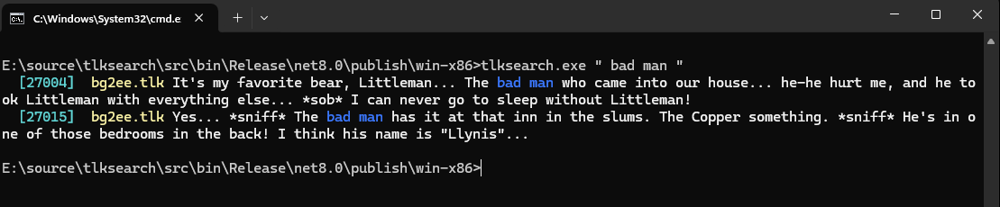

## Introduction

tlksearch is a command line application to search for strings in Infinity Engine TLK files.



## Download

Compiled downloads are not available.

## Compiling

To clone and run this application, you'll need [Git](https://git-scm.com) and [.NET](https://dotnet.microsoft.com/) installed on your computer. From your command line:

```
# Clone this repository
$ git clone https://github.com/btigi/tlksearch

# Go into the repository
$ cd src

# Build  the app
$ dotnet build
```

## Usage

tlksearch is a command line application and should be run from a terminal session. The application accepts a single command-line argument; the text to search for.

Usage examples:

 ```tlksearch kobold```

 ```tlksearch " liar"```

## Configuration

tlksearch will search all TLK files in the directory configuration as the `directory` setting in tlksearch.json. It's intended to place a copy of the TLK from each game, renamed after the source game, in a single directory.

tlksearch output is colourised to allow easier visual parsing. The colours can be customised in the tlksearch.json file.

## Licencing

tlksearch is licenced under the MIT license. Full license details are available in license.md